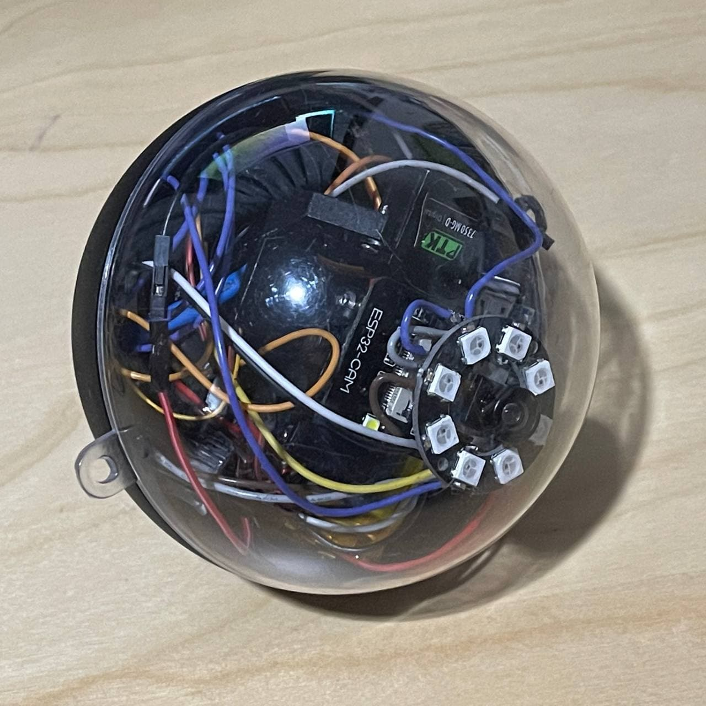
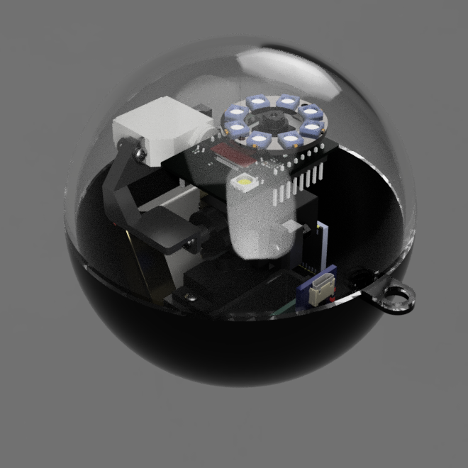

# Rainbow Six Blackeye Camera

Inspired by Valkyrie's gadget from the game, this gadget is a throwable camera in a ball. It's durable and sticky enough to cling onto a wall, and easily accessible via phone.

This gadget is surprisingly doable in real life, and exists in _more practical_ forms in the military. However, as a maker, we just want to make something close to the real thing on a shoestring budget. So that's exactly what I did!

The gadget is centered around a 3-axis gimbal comprising three servo motors. Two of them are the venerable MG90S to lower cost, while the top one (pitch) is a smaller sub-micro servo motor. The rotational axes of all servos are centered to converge at a single point within the middle servo, directly below the camera lens. This means that the camera should rotate evenly throughout, giving a smooth appearance on video.

To make your own Blackeye camera, follow the steps below:

1. Find the parts required at your local retailer, taking reference from the [BOM](hardware/blackeye-BOM.csv)
2. Based on your servos and dimensions, CAD a servo armature to complete the 3-axis gimbal
3. Wire the components up, and take note of the specific GPIO pins they're connected to: you'll need this for programming
4. Program the ESP32-CAM and the ESP32 handling the servos separately, with the firmware in their respective folders
5. Apply gel tape to the back to provide the "stickiness" function

## Mechanical Design

I use Fusion 360 to make a rough model for initial sizing, and designing the 3D-printed servo armatures. These are required to mount the servos to each other in the gimbal arrangement. For most components, exact dimensions are not available online, so I approximated them based on photos.

The outer shell was originally meant for a DIY Christmas Bauble. It comes in suprisingly useful, being clear and perfectly round. It's much easier to buy this part than 3D-print it on your own.

## Electrical Design

There are two ESP32s, one on the ESP32-CAM and the other to handle servo control and gyroscope/accelerometer readings. I originally tried to use only the ESP32-CAM, but I wasn't able to get the code running. The I2S peripheral used for the camera communication was conflicting with the PWM timer peripherals used by the servo controller. Powering everything was difficult, as the on-board LDO (AMS1117) was unable to provide enough power on the 3V3 rail for both ESP32s, constantly causing brownouts.

## Firmware

There are two separate source files for the ESP32-CAM and the ESP32 for the servo. They're based on the Arduino Framework and can be uploaded using the PlatformIO extension. It manages the libraries used, and makes uploading firmware to the ESP32 easy.

## References

This project referenced the following projects:

- [ESP32-CAM Code](https://github.com/easytarget/esp32-cam-webserver)
- [A previous project making the Blackeye, but with a FPV camera](https://www.youtube.com/watch?v=Ls4eikY1RBY)
- [ESP32 Wifi Robot, for the Web Interface](https://github.com/CoretechR/ESP32-WiFi-Robot)
